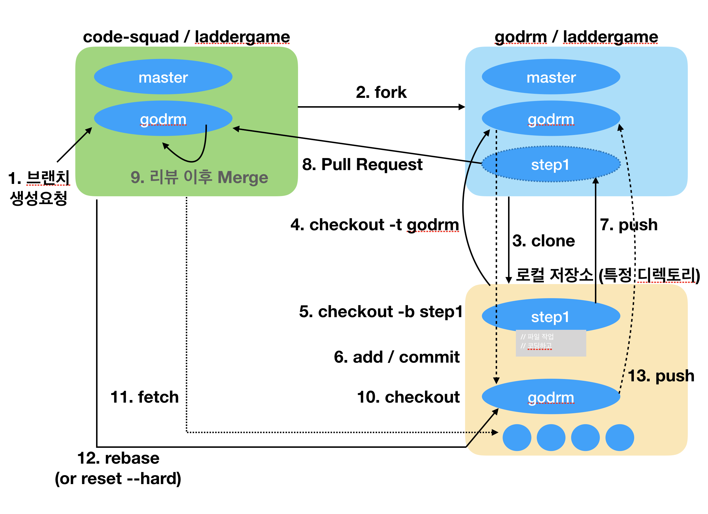

= Git

=== Git  
* 분산 버전 관리 시스템 

=== Git 주요 명령어
* _git init_
** 새로운 Repository를 만듬

* _git clone <Remote-Repository-Host> <Directory-Name>_
** 원격 저장소를 복제 받아 로컬 저장소를 생성함

* _git fetch_
** 원격 저장소의 변경사항을 가져옴

* _git pull origin master_
** 원격 저장소의 변경사항을 가져와서(fetch), 로컬 저장소로 함침(merge)

* _git add <File-Name or Directory-Name>_
** 새로 작업된 파일/디렉토리를 인덱스에 추가함
           
* _git commit | git commit –m “이 커밋에 대한 설명”_
** 변경된 내용을 확정하여 지점을 만들고, HEAD에 반영함

* _git commit –-amend_ 
** 최근 커밋의 내용(커밋 파일 추가 or 메시지 수정)을 수정하고 덮어씀

* _git push | git push origin master_
** 원격 저장소로 반영함

* _git stash_
** 워킹 디렉토리에 unstaged 파일들을 백업하고 워킹디렉토리를 깨끗한 상태 즉 HEAD의 상태로 만든다
----
$ git stash save : 현재 작업을 저장하고 HEAD로 복원함
$ git stash list : 저장된 stash 목록을 보여줌
$ git stash pop : 가장 최근에 저장한 stash를 꺼내서 적용함
$ git stash apply : stash pop과 동일하지만 list에서 삭제하지 않음
$ git stash clear : 전체 stash 삭제
$ git stash drop : 필요없는 stash 삭제
----

* _git status_
** 현재 저장소의 상태(브랜치 정보 및 commint/add 해야할 파일)를 확인함

* _git branch_
----
$ git branch <Branch-Name> : 현재 Repository에 새로운 브랜치 생성
$ git branch : 로컬 브랜치 목록 확인
$ git branch -r : 원격 브랜치 목록 확인
$ git branch –a : 로컬&원격 브랜치 목록 확인
$ git branch –d <Branch-Name> : 브랜치 삭제
----

* _git checkout_
----
$ git checkout <Branch-Name> : 브랜치 이동
$ git checkout –b <Branch-Name> :  브랜치 생성하고 해당 브랜치로 이동
$ git checkout <File or Directory Name> : 해당 파일 혹은 디렉토리를 마지막 커밋상태로 되돌림
$ git checkout <Commit-ID>  : 해당 커밋ID의 상태로 되돌림
----

* _git reset_
** 특정 커밋을 취소함
----
$ git reset –-hard <Commit-ID> : 커밋ID에 해당하는 커밋을 취소함
$ git reset –-hard HEAD^ : HEAD의 가장 최근 커밋을 취소함(복구불가)
$ git reset –soft HEAD^ : HEAD의 가장 최근 커밋을 취소험(복구가능)
----

* _git revert_
** 기존의 커밋에서 변경한 내용을 취소해서 새로운 커밋을 만듬
** 되돌린 이력을 남기지만 되도록 쓰지 않는게 좋음
----
$ git revert <Commit-ID> 
$ git revert HEAD : 가장 최근 커밋을 취소하고 새 커밋을 만듬
----

* _git reset —hard_
** 버전을 되돌리지만, 되돌린 이력이 남지 않음. 되도록 쓰지 않는게 좋음

* _git merge <Branch-Name>_
** 브랜치를 현재 브랜치로 합침
 
* _git rebase <Branch-Name>_
** 브랜치의 변경사항을 현재 브랜치에 적용함

* _git cherry-pick <Commit-ID>_
* 특정 하나의 커밋만 rebase함

* _git log_
----
$ git log -10 : 최근 10개의 커밋로그를 보여줌
$ git log –pretty=oneline : 한줄로 보여줌
$ git log --graph : 그래프 형태로 보여줌
$ git shortlog : 짧은 로그를 보여줌
----

* _git reflog_
** 로컬에 작업된 커밋 로그을 보여줌

* _git config_
----
$ git config --global user.name “이름”
$ git config --global user.email “이메일주소”
$ git config --global color.ui auto
----

* _git diff <File-Name>_
** 해당 파일의 로컬과 원격의 차이점을 보여줌
----
$ git diff HEAD : 로컬 변경사항을 한눈에 볼 수 있음
----

* _git remote_
** 원격 저장소 정보를 확인, 설정함
----
$ git remote add origin master <Remote-Repository-Host> : 현재 로컬 저장소와 원격 저장소를 연결함
$ git remote show <Repository-Name> : 원격 저장소의 정보를 확인함
$ git remote rm <Repository-Name> : 원격 저장소를 제거함
$ git remote update : 원격 저장소 정보를 업데이트함
----

* _git blame <File-Name>_
** 코드 라인별로 커밋ID 와 커밋한 사람등의 정보를 보여준다
----
$ git blame –L 1, 10 <File-Name> : 1-10라인 정보를 보여줌
----

* _git show_
----
$ git show <Commit-ID> : 특정 커밋ID의 로그를 보여줌
$ git show <Branch-Name> : 특정 브랜치의 최근 커밋 로그를 보여줌
$ git show HEAD^ : 현재 브랜치의 최근 커밋 로그를 보여줌
----

* _git submodule_
** 저장소 안에 또 다른 독립 저장소
----
$ git submodule add <Remote-Repository-Host> <Directory-Name> : 새로운 서브모듈을 추가함
$ git submodule init : 서브모듈을 초기화함
$ git submodule update : 원격 저장소에서 Checkout받음
----

=== Git 용어 설명
* 개발할 때, Working Directory를 건드리고 저장할 때 .git파일을 건드림
* '-' 단축옵션, '--' 진짜옵션
* commit객체를 제외하고 나머지 참조값
* HEAD : 마지막 커밋의 참조
* commit
** 로컬 저장소 저장
** HEAD에다가 자식을 만듬
** git commit 객체는 전세계적으로 다름
** git commit 엔터를 누른다면 현재 head에서 커밋 포인트를 만들고 head가 가르치고 있는 현재 branch로 갱신함. head가 가르키고 있는 branch가 없다면 branch 갱신하지 못함
* branch : 객체의 참조(=세이브 포인트의 참조)
* checkout : head에서 해당 브랜치의 주소를 가리킴
* tag : 배포파일에 버전을 붙일 때 사용한다. branch 이름과 중복되면 안됨
* push : 특정 브랜치를 커밋할 때, 연결된 커밋 내역들만 원격서버에 반영됨
* merge: 다른 브랜치를 하나의 새로운 commit으로 합침. 따라서 부모가 두 명
* rebase : 로컬에서만 사용하는 것이 좋음. 두 브랜치의 차이를 밝혀서 한 브랜치로 만들어줌

=== Git이 만약 부모노드에서 자식노드로 합쳐진다면 ?
* 부모 노드가 자식 노드으로 합쳐질 경우 부모 노드에서도 수정이 빈번히 일어나게 되므로 문제가 발생하기 때문에 자식노드가 부모 노드로 합쳐짐

=== 협업

* 타켓 저장소의 프로젝트를 자신의 계정으로 fork함
* fork한 프로젝트를 내 컴퓨터로 클론함
----
$ git clone https://github.com/yuaming/swift-laddergame
----
* Clone한 프로젝트 이동하고 본인 아이디로 브랜치를 만들기 위한 Checkout
----
$ git checkout -t origin/yuaming
----
* 기능 구현을 위한 브랜치 생성
----
$ git checkout -b ladder-step1
----
* 아래 명령어를 이용해 작업 후 커밋
----
$ git status
$ git rm 파일명 : 파일 삭제
$ git add 파일명(or * 모두) : 파일 추가
$ git commit -m "메세지" : 커밋
----
* 본인 원격 저장소 푸시, 현재 브랜치 연결
----
$ git push --set-upstream origin ladder-step1
----
* Pull Request
----
base : code-squad/[프로젝트명] [내아이디] 브랜치 -> compare : [내서버]/[프로젝트명] [현재단계] 브랜치
----
* 코드 리뷰, 기능 개선 및 푸시
* 기본(upstream) 브랜치 전환 및 base 저장소 추가(시작 단계에서 1회만 하면 됨)
----
$ git checkout yuaming
$ git remote add upstream https://github.com/code-squad/swift-laddergame.git
$ git remote -v : 원격 저장소 브랜치 목록 확인
----
* 기본 base저장소와 sync (PR 보낸 내용을 자신의 기본 저장소와 합침
====
....
$ git fetch upstream
$ git rebase upstream/yuaming
$ git push -f : 강제 푸시
....

....
$ git checkout test
$ git rebase yuaming

test 브랜치를 yuminag 브랜치로 합침
....
====
  
* _#upstream 저장소 브랜치에 자신의 github 아이디에 해당하는 브랜치가 존재해야 함#_
* _#자신의 github 아이디에 해당하는 브랜치가 있는지 확인해야 함#_

=== 참고자료
. https://github.com/honux77/practice/wiki/learngit[Git 참고자료(honux77 Github)]
. https://backlog.com/git-tutorial/kr/intro/intro1_1.html[누구나 쉽게 이해할 수 있는 Git입문]

