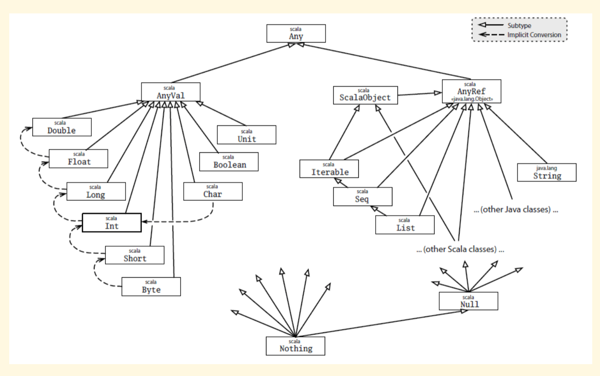

= Scala

=== 1주
* 스칼라를 통해 얻는 것
** https://medium.com/rainist-engineering/스칼라의-도입을-회고하며-d491125abeb9[스칼라로 얻을 수 있는것]
** 간결하고 정확한 문법을 가짐
** 중간 이상 규모의 프로젝트에서도 안정성을 가지고 사용할 수 있음
** **JVM** 위에서 돌아감

* REPL 사용
** Read Eval Print Loop
** 커멘드를 입력하면 시스템이 값을 반환하는 환경임
** 값 재활용 가능
** _:Help_ 입력하면 사용할 수 있는 명령어를 확인할 수 있음

* 리터럴, 값, 변수, 상수
** 리터럴 : 5, A, "Hello! Scala" 같이 소스에서 바로 확인할 수 있는 데이터
** 값 : 불변 타입 데이터 저장단위
** 변수 : 가변 타입 데이터 저장단위
** 타입 : 데이터 종류

* 값 정의
** val name: type = value

* 변수 정의
** var name: type = value

* 타입

* 숫자
** Primitive Type이 존재하지 않음

* 문자열
[source,scala]
----
scala > var s = "Hello"
s: String = Hello

scala > s * 2
res3 : String = HelloHello

scala > s + " Scala"
res4 : String = HelloHello Scala
----

* 멀티라인
[source,scala]
----
scala > var ml = """
    | hello
    | scala
    | """
ml: String = 
"
hello
scala
"
----

* 문자열 보간
** 변수나 값이 합쳐진 문자열을 만들 수 있는 기능을 문법차원에서 제공함
[soure,scala]
----
scala > var price = 500
price: Int = 500

scala > println(s"신라면 가격은 $price 입니다")
신라면 가격은 500 입니다

scala > println(s"신라면 2개 가격은 ${price * 2} 입니다")
신라면 가격은 1000 입니다
----

* 튜플
[soure,scala]
----
scala > varl phone = ("iphone6s", "64g", 100)
phone: (String, String, Int) = (iphone6s,64g,100)

scala > phone._1
res8: String = iphone6s
----

=== 참고자료
. https://slipp.net/questions/170[함수형 프로그래밍 패러다임]
. https://medium.com/@lazysoul/함수형-프로그래밍이란-d881230f2a5e[함수형 프로그래밍 패러다임2]
. https://medium.com/@lazysoul/functional-programming-%EC%97%90%EC%84%9C-1%EA%B8%89-%EA%B0%9D%EC%B2%B4%EB%9E%80-ba1aeb048059[일급객체]
. http://docs.scala-lang.org/tour/tour-of-scala.html[Scala Tutorial]